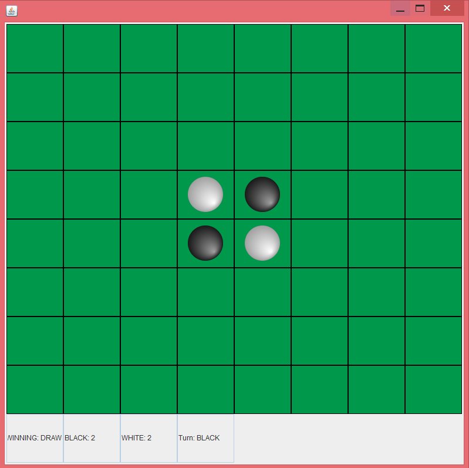

# Othello Board Game

# Team Members
Yuxuan Zou and Ryan Aday

# Instructions 
Run the mainMenu java file and the GUI will pop up. Click playGame to play, manual reading is on the bottom and you can change the player name 
by typing it in. The rules for Othello are simple and it should all be covered in the manual reading. Game ends when the board is filled with pieces of both color, the person with more pieces wins. This is a 2 player game so challenge your friends to a duel. You can also try the blitz mode which gives both players 1 minute to finish the game and try to get as much pieces as possible. The Blitz mode button is on the right of the mainMenu screen.

# Game Features 
-Clickable grids for placing pieces  
-Ghost pieces which pops up when you hover over a certain grid 
-Shows avaliable moves using ghost pieces 
-Winning screen which pops up after a player wins 
-Text boxes at the bottom which shows the player's turn and how many pieces they currently own 
-Blitz mode, players only has 1 min to finish the game, whoever gets more pieces after 1 minute wins 

# Dev Log
-1/3/18: Initial Commit/started code on mainMenu 
-1/4/18: Added pictures for white and black pieces, started coding on the board 
-1/5/18: implemented panel switching to switch from mainMenu to Board 
-1/6/18: Added abstract classes 
-1/7/18: Added all mouseEvent methods and wrote code regarding the pieces 
-1/8/18: Made the Board pop up using 2D arrays, changed everything into non-abstract classes 
-1/9/18: Made edits to constructor and made Pieces class inherit JButtons 
-1/10/18: Started on the ghost Pieces and added victory class for victory pop up 
-1/11/18: Wrote Some methods for Pieces class and made the turn system 
-1/12/18: Started working on the rules 
-1/13/18: Made direction checks for the rules 
-1/14/18: the IsValidMove is completed and the ghost pieces successfully work, also added name changer and victory screen 
-1/15/18: Added manual to mainMenu and made checks for corner pieces and border pieces. All the rules for the game are finished 
-1/16/18: Didn't make any changes this day 
-1/17/18: Added methods to check when a player runs out of turn, didn't see that it was already implemented in victory screen 
-1/18/18: Didn't make any changes 
-1/19/18: Deleted the redundant code and started working on blitz mode  
-1/20/18: Found a small error in direction checks and fixed it  
-1/21/18: Finished blitz mode, the thing is basically finished  